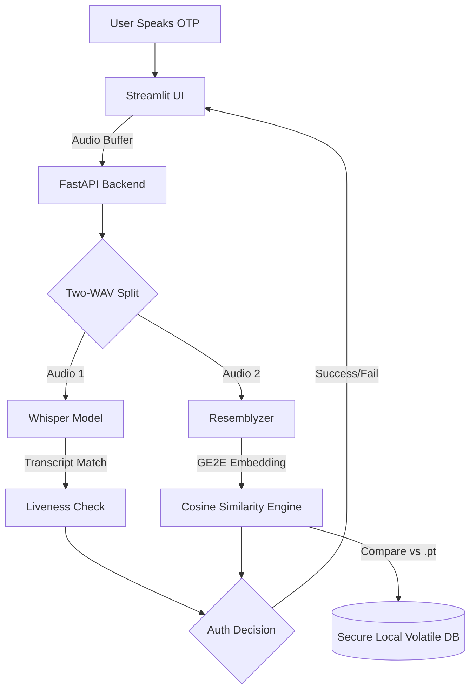

<div align="center">
  
  
  
  
  
  <br />
  
  <h1>🛡️ VoiceGuard</h1>
  <h3>AI-Powered Local Voice Authentication System</h3>
  <p>A highly secure, offline-first voice authentication pipeline leveraging Deep Learning and Generative Voice Emulating countermeasures.</p>

  <!-- Add an impressive hero image or demo GIF link here later -->
  <!--  -->

</div>

<hr />

## 📖 Overview

**VoiceGuard** is an advanced, fully local voice authentication system developed for high-security access control. It combines the power of large speech models with rigorous zero-trust verification methodologies. 

By utilizing **OpenAI's Whisper** alongside **Resemblyzer's GE2E embeddings**, VoiceGuard accurately maps an individual's unique vocal characteristics while actively defending against spoofing and recording replay-attacks using an intelligent **Two-WAV preprocessing strategy**. 

## ✨ Key Features

- **Robust Voice Biometrics:** Generates high-fidelity user embeddings using PyTorch-based Resemblyzer.
- **Liveness Verification:** Prevents replay attacks using Whisper to enforce dynamically generated OTP/phrase verbalization constraints.
- **100% Offline Processing:** Completely localized architecture means zero data transmission to external APIs, ensuring unparalleled data privacy.
- **Two-WAV Defensive Strategy:** Simultaneously processes audio for transcription (liveness) and speaker verification (identity) securely.
- **FastAPI Microservice Backend:** High-performance RESTful API completely decoupled from the UI.
- **Streamlit Frontend:** A sleek, minimal, enterprise-grade control panel for system interaction.

## 🏗️ Architecture



## 🚀 Getting Started

### Prerequisites
- Python 3.9+
- Pip & Virtual Environment
- Local microphone access

### Installation

1. **Clone the repository**
   ```bash
   git clone https://github.com/Kinjal Abrol/VoiceGuard-AI-Powered-Voice-Authentication-System.git
   cd VoiceGuard-AI-Powered-Voice-Authentication-System
   ```

2. **Create and activate a virtual environment**
   ```bash
   python -m venv venv
   source venv/bin/activate  # On Windows use: venv\Scripts\activate
   ```

3. **Install dependencies**
   ```bash
   pip install -r requirements.txt
   ```

### Running the System

**1. Start the API Backend**
```bash
# In your terminal
uvicorn main:app --reload
```
*The FastAPI backend will start running on `http://127.0.0.1:8000`.*

**2. Start the Frontend UI**
```bash
# In a new terminal window
streamlit run app.py
```
*The web interface will be accessible at `http://localhost:8501`.*

## 🔒 Security & Privacy (Local-First Guarantee)

VoiceGuard is built on a "Local-First" privacy model. 
- **Voice Samples (`.wav`):** Never saved to disk permanently; stored in volatile memory during inference.
- **Embeddings (`.pt`):** Kept exclusively in localized `.pt` files, effectively representing highly secure numeric hashes that cannot be reverse-engineered to reconstruct an audio file.
- **Zero Third-Party APIs:** No commercial cloud endpoints are contacted during the authentication flow.

## 🔮 Future Scope
- Integration with Anti-Spoofing CNN models for deeper frequency analysis.
- Transitioning the UI to React/Next.js for broader enterprise deployment.
- Expanding liveness detection using acoustic footprint correlation.

## 📜 License
This project is licensed under the MIT License - see the `LICENSE` file for details.

## 👨‍💻 Contributors
- **Kinjal Abrol** - Lead Developer & Architect

---
*Built with precision for advanced AI systems research.*

